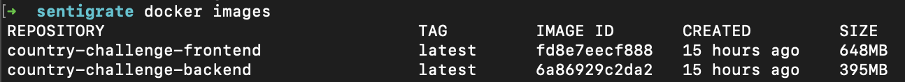
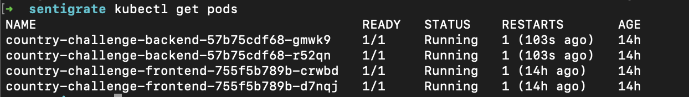

# Welcome to FullStack Country and Exchange Challenge

The goal of this test is to retrieve data from several restful web services, store the data in a database and report the results back to the end-user.

### Technologies Used

   

[Demo](https://country-challenge.vercel.app/dashboard)
## Important!
**Before starting to react be sure the backend is working. If you click the demo link wait for 10 seconds backend Heroku server will awake soon then you can show the country information**

### Getting Started
1. Clone this repo
2. `npm install` on both `frontend` and `backend` folders
3. `npm start`

### Run with Docker
1. Each backend and frontend folder has a Dockerfile and `build.sh` you can simply run `build.sh`.
2. When you write `docker ps` command you will see like below images both frontend and backend works fine.

### Run with Kubernetes
1. Open K8S folder.
2. First write `minikube start` command in terminal and be sure attach local docker deamon images to minikube `eval $(minikube -p minikube docker-env)` then apply each yaml `kubectl apply -f backend-deployment.yaml` and `kubectl apply -f  frontend-deployment.yaml`
3. Access pod from browser using port forward command `kubectl port-forward country-challenge-frontend-755f5b789b-crwbd 3000:3000`

