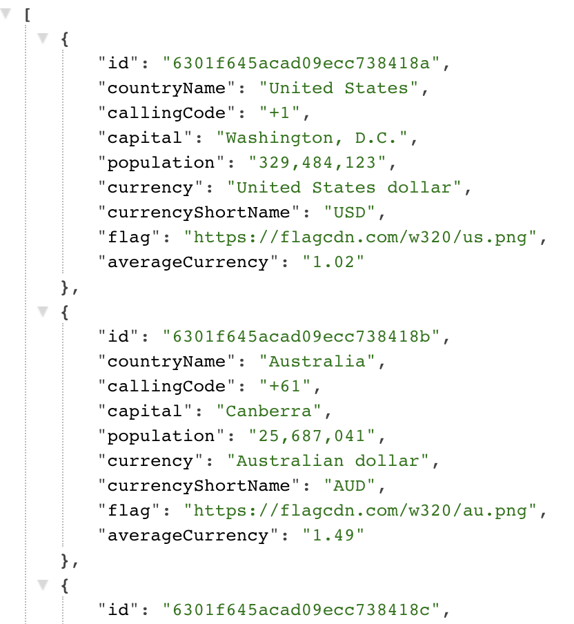
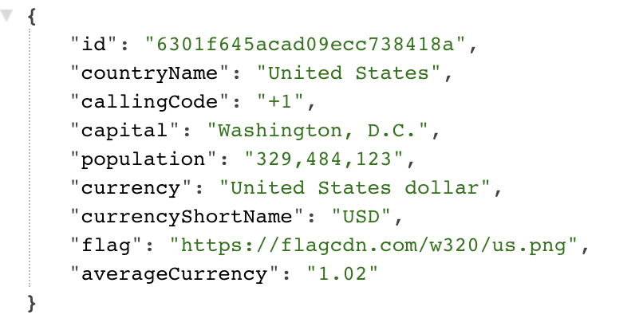

# Country Backend

This application demonstrates that request several apis and save database by seed.

You can test get request countries below in code snippet.

[Demo](https://sentigrate-country-backend.herokuapp.com/countries)

### Get All Countries

https://sentigrate-country-backend.herokuapp.com/countries



### Get Detail of Country

https://sentigrate-country-backend.herokuapp.com/country/6301f645acad09ecc738418b



## Run locally

```shell
npm install
npm run start
```

## .env file

```shell
API_KEY = { FIXER_API_KEY }
DATABASE_URL = { MONGO_DB_URL }
```

## Important!

**Dont forget to add cluster db name on your mongoDB url.Location is before the `?retryWrites`**

## Developed Npm and Node Version

```
node -v
v16.15.0

npm -v
8.5.5
```
