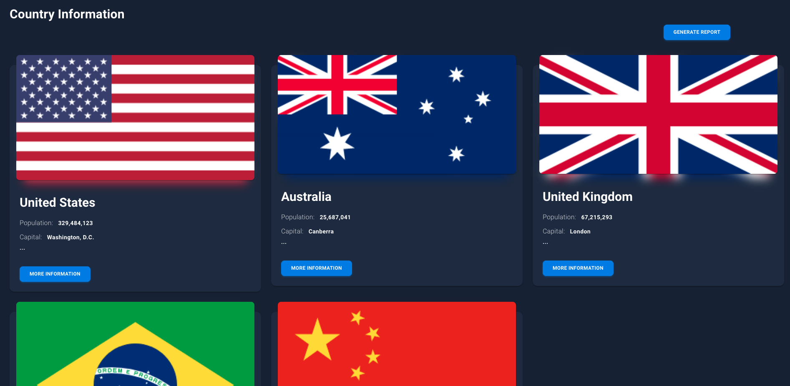

# Country Frontend

Showing several countries' information from the backend.



[Demo](https://country-challenge.vercel.app/dashboard)

## Important!

**Before starting to react be sure the backend is working. If you click the demo link wait for 10 seconds backend Heroku server will awake soon then you can show countries.**

## Run locally

```shell
npm install
npm start
```

## Test locally via Cypress

Before starting the test be sure frontend runs.

```shell
npm test
```

## .env file

```shell
REACT_APP_BASE_URL = { BASE_URL }
```

## Developed Npm and Node Version

```
node -v
v16.15.0

npm -v
8.5.5
```
